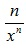
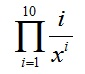

**Тема:** Методы

**Цель работы:** Научиться работать с методами, написать программу с использованием методов

**Постановка задачи:** Написать метод, вычисляющий значение  . С его помощью вычислить выражение: 
 
