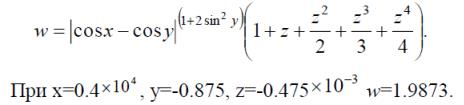

**Тема:** Элемент управления Chart. Построение графиков функций.

**Постановка задачи:** Постройте графики функций для:  

Таблицу данных получить путём изменения параметра X с шагом h. Самостоятельно выбрать удобные параметры настройки
